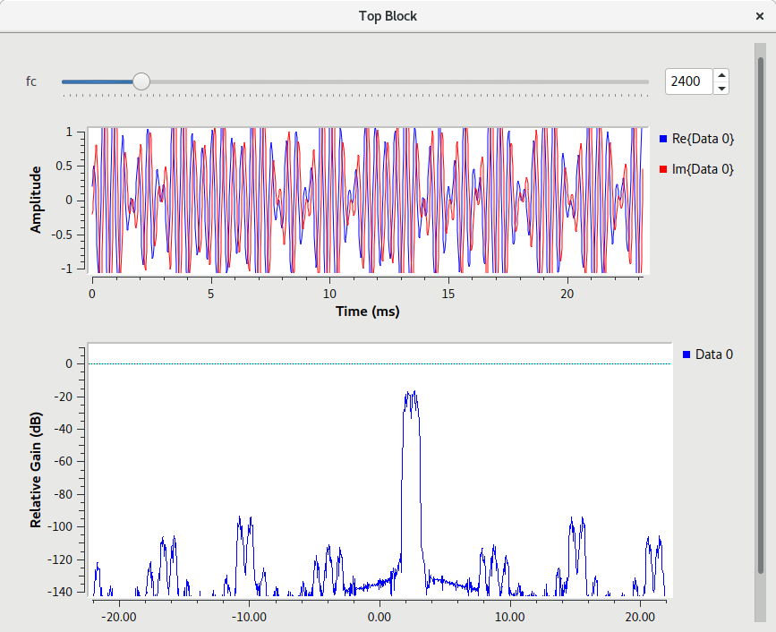

## Projeto 3 Camada Física - 2017.2

Sabrina S.
Alexandre Y.

## Modulação Digital

## Frequência e Banda

A frequência utilizada é a que melhor divide o diagrama de constelação em dois polos espelhados. Dessa forma, nossa frequência foi de 2400Hz.
A banda ocupada pelo sinal é sempre o dobro da frequência, ou seja, 4800Hz.

## Funcionamento

O objetivo do projeto é fazer um chat que envia mensagens via modulação digital, e faz a conexão transmissor/receptor. Ao rodar o código em dois locais, é possível estabelecer um "chat virtual", usando o ar como meio.

Primeiramente, o usuário da imput na string desejada em uma UI, que recebe e envia tal string a um script de python dedicado a transforma-la e transmiti-la em bytes. 

Após a conversão para bytes ser feita, um terceiro programa, o GNURADIO, recebe estes bytes e os transmite como ondas sonoras.
Este mesmo programa é dedicado a receber os bytes e, com auxilio de um script (receiver.py), mapeia no mapa de constelações como explicado abaixo na subcategoria BPSK.

Este script receiver.py é gerado pelo próprio programa do GNURADIO, que possui um mapa visual do código, enquanto o .py não é recomendado para leitura pelo usuário, por ser um tanto complexo (por ser gerado por um computador). 

Este mesmo script realiza a demodulação e atribui cada byte a uma letra, fazendo a reconstrução da string original do usuário.

## BPSK

BPSK (Binary Phase Shift Keying) é um tipo de Phase Shift Keying que usa termos binários para modular digitalmente os sinais no mapa de constelações. Dessa forma, cada sinal é recebido ou como 0, ou como 1. 

Caso seja 0, o BPSK usa a equação S (t) = ± A* cos (2*π*f*t)

Caso seja 1, é usado S (t) = A* cos (2*π*f*t+π)

Como os valores não são sempre iguais, devido à ruidos, o mapa fica com algumas divergências:

BPSK teórico|BPSK com ruído|
:-------------------------:|:-------------------------:
   |   

## Gráficos do Tx

### Tempo e frequencia do sinal não codificado

O primeiro gráfico mostra os valores binários a serem enviados no tempo

O segundo gráfico mostra a frequência em que está sendo enviado certo sinal binário

	
### Tempo e frequência do sinal codificado

O primeiro gráfico mostra os valores em float (de -1 a 1) do sinal no tempo. Como o valor é um complexo, a parte que varia de -1 a 1 é apenas a real

O segundo gráfico mostra a frequência da onda anterior, como um gráfico de fourier, e percebe-se que ela tem uma frequência bem baixa. 

### Tempo e frequência do sinal modulado

O primeiro gráfico já mostra o sinal modulado em BPSK, e percebe-se que a onda está bem mais comprimida

Como visto no gráfico anterior, a onda estando bem comprimida também aumenta a frequência, que está relativamente maior que do sinal não modulado

### Diagrama de Constelação

O diagrama de constelação do transmissor é um spectro que vai de 0 a 1, pois representa somente os valores binários a ser enviados, porém com alguns valores captados no meio, visto que o sinal físico esta transitando entre 0 e 1

## Gráficos do Rx

### Sinal de áudio recebido no tempo e em frequência

Assim como nos gráficos do sinal modulado, este é a versão recebida. Percebe-se tanto no tempo como na frequência as distorções do meio (ar).

### Sinal de áudio demodulado no tempo e em frequência

Ambos gráficos mostram a demodulação do sinal recebido, ou seja, possuem restos de interferência do meio, mas são relacionados aos gráficos de tempo e frequência modulados do Tx.

### Diagrama de Constelação

Este diagrama de constelação mostra ambos polos da modulação BPSK. Nesta modulação, é desejado que os sinais recebidos fiquem com 180 graus de diferença, e evitem cair no centro (0,0). Eles deveriam cair em 1 e -1, porém o ruído do meio faz com que caiam em pontos próximos, como explicado anteriormente.

Sabrina & Ale

